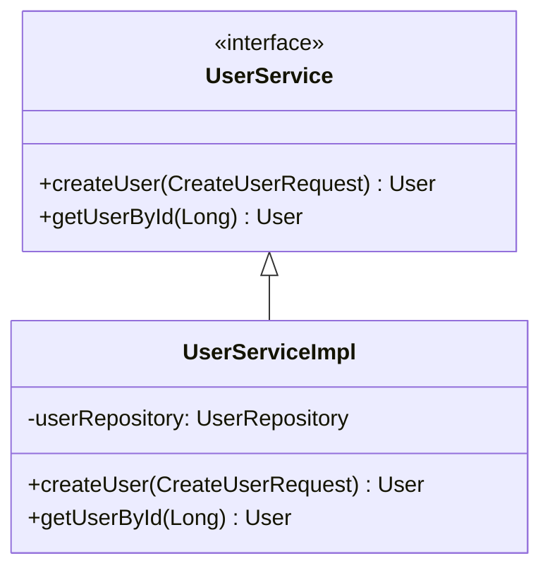

# Spring Boot Hub 🚀

<div align="center">
  <h3>스프링부트 개발의 진입장벽을 해소하는 종합 가이드</h3>
  <p>탄탄한 기초부터 고급 디자인 패턴까지, 코드 중심의 예제와 시각적 다이어그램으로 학습하세요</p>

  [](https://jeonck.github.io/spring-boot-hub/)
  [](https://github.com/jeonck/spring-boot-hub)
  [](https://reactjs.org/)
  [](https://spring.io/projects/spring-boot)
</div>

---

## 📋 목차

- [✨ 프로젝트 소개](#-프로젝트-소개)
- [🎯 주요 기능](#-주요-기능)
- [🏗️ 프로젝트 구조](#️-프로젝트-구조)
- [🚀 빠른 시작](#-빠른-시작)
- [📚 학습 콘텐츠](#-학습-콘텐츠)
- [🎨 디자인 패턴 다이어그램](#-디자인-패턴-다이어그램)
- [💡 사용 기술](#-사용-기술)
- [🤝 기여하기](#-기여하기)
- [📄 라이선스](#-라이선스)

---

## ✨ 프로젝트 소개

**Spring Boot Hub**는 Spring Boot 개발을 처음 시작하는 개발자들을 위한 종합적인 학습 플랫폼입니다. 복잡한 개념을 시각적 다이어그램과 실무 중심의 예제 코드로 쉽게 설명하여, 개발자들이 Spring Boot의 핵심 개념을 빠르게 습득할 수 있도록 돕습니다.

### 🎯 프로젝트 목표

- **진입장벽 해소**: 복잡한 Spring Boot 개념을 직관적으로 이해할 수 있도록 시각화
- **실무 중심 학습**: 실제 프로젝트에서 사용되는 패턴과 구조를 예제로 제공
- **종합적 가이드**: 기초부터 고급까지 단계별 학습 로드맵 제공
- **최신 기술 반영**: Spring Boot 3.x 기준의 최신 기능과 모범 사례 포함

---

## 🎯 주요 기능

### 📖 **15개 핵심 디자인 패턴**
- **MVC, Repository, DTO, Builder** 등 필수 패턴
- **Command, Saga, Proxy, Decorator** 등 고급 패턴
- **Mermaid 다이어그램**으로 시각적 이해 제공
- **실제 Spring Boot 코드 예제** 포함

### 🛠️ **다양한 빌드 도구 지원**
- **Gradle**: 모던 빌드 자동화 도구
- **Maven**: 전통적인 의존성 관리 도구
- **Kotlin**: 현대적인 JVM 언어로 작성된 예제

### 🌐 **폐쇄망 환경 지원**
- **Nexus Repository** 완전 가이드
- **오프라인 개발 환경** 구축 방법
- **의존성 관리** 전략

### ⚙️ **환경 설정 가이드**
- **프로파일별 설정** 관리
- **application.yml vs properties** 비교
- **자동 구성(Auto-configuration)** 이해

---

## 🏗️ 프로젝트 구조

```
spring-boot-hub/
├── 📁 react-app/                    # 📖 문서화 웹사이트 (Vite + React + Tailwind)
│   ├── src/
│   │   ├── components/              # 🧩 재사용 가능한 React 컴포넌트
│   │   │   ├── MermaidDiagram.jsx   # 📊 다이어그램 렌더링 컴포넌트
│   │   │   └── Navbar.jsx           # 🧭 내비게이션 컴포넌트
│   │   ├── pages/                   # 📄 메인 문서 페이지들
│   │   │   ├── Home.jsx             # 🏠 홈페이지
│   │   │   ├── DesignPatterns.jsx   # 🎨 디자인 패턴 가이드 (15개 패턴)
│   │   │   ├── GradleExamples.jsx   # 🔧 Gradle 예제
│   │   │   ├── MavenExamples.jsx    # 📦 Maven 예제
│   │   │   ├── KotlinExamples.jsx   # 🎆 Kotlin 예제
│   │   │   ├── Configuration.jsx    # ⚙️ 설정 가이드
│   │   │   ├── ComparisonGuide.jsx  # 📊 기술 비교
│   │   │   └── NexusGuide.jsx       # 🏛️ Nexus 폐쇄망 가이드
│   │   └── App.jsx                  # 🎯 메인 애플리케이션
│   ├── public/                      # 📂 정적 파일
│   └── package.json                 # 📋 의존성 관리
├── 📁 spring-boot-examples/         # 💻 Spring Boot 예제 프로젝트들
│   ├── gradle-examples/             # 🔧 Gradle 기반 예제들
│   ├── maven-examples/              # 📦 Maven 기반 예제들
│   └── kotlin-examples/             # 🎆 Kotlin 기반 예제들
├── 📁 backend-examples/             # 🌐 프로덕션급 백엔드 예제들
├── 📁 docs/                         # 📚 추가 문서들
├── 📁 .github/workflows/            # 🔄 GitHub Actions CI/CD
│   └── deploy.yml                   # 🚀 자동 배포 워크플로우
├── 📋 CLAUDE.md                     # 🤖 Claude Code 프로젝트 가이드
└── 📖 README.md                     # 📘 이 파일
```

---

## 🚀 빠른 시작

### 📋 필요 조건

- **Node.js** 18+
- **npm** 또는 **yarn**
- **Java** 17+ (Spring Boot 예제 실행 시)
- **Git**

### 🔧 로컬 개발 환경 설정

```bash
# 1. 저장소 클론
git clone https://github.com/jeonck/spring-boot-hub.git
cd spring-boot-hub

# 2. 프론트엔드 의존성 설치
cd react-app
npm install

# 3. 개발 서버 시작
npm run dev
```

개발 서버가 `http://localhost:5173`에서 실행됩니다.

### 🏗️ 빌드 및 배포

```bash
# 프로덕션 빌드
npm run build

# 빌드 결과 미리보기
npm run preview
```

### 🌐 온라인 데모

GitHub Pages에서 실제 동작하는 사이트를 확인할 수 있습니다:
**[https://jeonck.github.io/spring-boot-hub/](https://jeonck.github.io/spring-boot-hub/)**

---

## 📚 학습 콘텐츠

### 🎨 **15개 핵심 디자인 패턴**

| 패턴 | 설명 | 다이어그램 | 예제 코드 |
|------|------|-----------|-----------|
| **🏢 MVC** | Model-View-Controller 아키텍처 | ✅ | ✅ |
| **🔌 의존성 주입** | IoC Container와 DI 패턴 | ✅ | ✅ |
| **🗄️ Repository** | 데이터 접근 계층 추상화 | ✅ | ✅ |
| **📦 DTO** | 데이터 전송 객체 패턴 | ✅ | ✅ |
| **🏗️ Builder** | 복잡한 객체 생성 패턴 | ✅ | ✅ |
| **🎯 Strategy** | 알고리즘 선택 패턴 | ✅ | ✅ |
| **🏭 Factory** | 객체 생성 팩토리 패턴 | ✅ | ✅ |
| **🎯 Singleton** | 단일 인스턴스 보장 패턴 | ✅ | ✅ |
| **👀 Observer** | 이벤트 기반 관찰자 패턴 | ✅ | ✅ |
| **📋 Template Method** | 알고리즘 구조 정의 패턴 | ✅ | ✅ |
| **🎭 Facade** | 복잡한 시스템 단순화 패턴 | ✅ | ✅ |
| **🎭 Proxy** | 대리자 및 AOP 패턴 | ✅ | ✅ |
| **⚡ Command** | 요청 캡슐화 및 CQRS 패턴 | ✅ | ✅ |
| **🔄 Saga** | 분산 트랜잭션 관리 패턴 | ✅ | ✅ |
| **🎨 Decorator** | 동적 기능 추가 패턴 | ✅ | ✅ |

### 🛠️ **빌드 도구 가이드**

- **🔧 Gradle**: 현대적 빌드 자동화
- **📦 Maven**: 전통적 의존성 관리
- **🎆 Kotlin**: JVM 기반 현대 언어
- **📊 완전 비교표**: Maven vs Gradle vs application.yml

### 🏛️ **폐쇄망 개발 환경**

- **Nexus Repository** 완전 구축 가이드
- **오프라인 의존성 관리** 전략
- **보안 정책** 준수 방법

---

## 🎨 디자인 패턴 다이어그램

프로젝트의 모든 디자인 패턴은 **Mermaid.js**를 사용하여 시각화되어 있습니다:

### 📊 다이어그램 종류

- **🏗️ 클래스 다이어그램**: 구조적 관계 시각화
- **⏰ 시퀀스 다이어그램**: 상호작용 흐름 표현
- **🌊 플로우차트**: 프로세스 흐름 도식화

### 🎯 주요 다이어그램 예시



---

## 💡 사용 기술

### 🎨 **프론트엔드**

| 기술 | 버전 | 용도 |
|------|------|------|
| **React** | 18.2.0 | UI 라이브러리 |
| **Vite** | 4.4.5 | 빠른 번들러 |
| **Tailwind CSS** | 3.3.0 | 유틸리티 CSS 프레임워크 |
| **React Router** | 6.x | 클라이언트 사이드 라우팅 |
| **Mermaid.js** | Latest | 다이어그램 렌더링 |

### 🌱 **백엔드 (예제)**

| 기술 | 버전 | 용도 |
|------|------|------|
| **Spring Boot** | 3.x | 메인 프레임워크 |
| **Spring Data JPA** | 3.x | 데이터 접근 계층 |
| **Spring Security** | 6.x | 보안 프레임워크 |
| **H2 Database** | 2.x | 인메모리 데이터베이스 |
| **Gradle/Maven** | Latest | 빌드 도구 |

### 🚀 **배포**

- **GitHub Pages**: 정적 사이트 호스팅
- **GitHub Actions**: CI/CD 자동화
- **Vite**: 최적화된 프로덕션 빌드

---

## 🤝 기여하기

Spring Boot Hub 프로젝트에 기여해주셔서 감사합니다!

### 📝 기여 방법

1. **🍴 Fork** 이 저장소
2. **🌿 브랜치 생성** (`git checkout -b feature/amazing-feature`)
3. **💾 변경사항 커밋** (`git commit -m 'Add amazing feature'`)
4. **📤 브랜치에 푸시** (`git push origin feature/amazing-feature`)
5. **🔄 Pull Request 생성**

### 🐛 버그 리포트

버그를 발견하셨다면 [Issues](https://github.com/jeonck/spring-boot-hub/issues)에서 리포트해주세요:

- **🔍 현재 동작**: 어떤 일이 일어나고 있는지
- **✅ 예상 동작**: 어떤 일이 일어나야 하는지
- **📝 재현 단계**: 문제를 재현하는 방법
- **💻 환경 정보**: OS, 브라우저, Node.js 버전 등

### 💡 기능 제안

새로운 기능 아이디어가 있으시면:

- **🎯 목적**: 이 기능이 왜 필요한지
- **📋 상세 설명**: 어떻게 동작해야 하는지
- **🎨 예시**: 가능하다면 목업이나 예시

---

## 👥 기여자

이 프로젝트를 더 나은 학습 자료로 만들어주신 모든 분들께 감사드립니다:

<div align="center">
  <a href="https://github.com/jeonck/spring-boot-hub/graphs/contributors">
    
  </a>
</div>

---

## 📈 로드맵

### 🔮 향후 계획

- [ ] **🔐 Spring Security** 심화 가이드
- [ ] **☁️ Spring Cloud** 마이크로서비스 패턴
- [ ] **📊 Monitoring & Observability** 가이드
- [ ] **🧪 Testing Strategy** 완전 가이드
- [ ] **🚀 Performance Optimization** 기법들
- [ ] **🌍 다국어 지원** (English)

### 📅 다음 버전 (v2.0)

- **인터랙티브 코드 에디터** 추가
- **실시간 예제 실행** 환경 구축
- **개인 학습 진도 추적** 기능
- **커뮤니티 Q&A** 섹션

---

## 📞 연락처

- **🐙 GitHub**: [@jeonck](https://github.com/jeonck)
- **🌐 프로젝트 링크**: [https://github.com/jeonck/spring-boot-hub](https://github.com/jeonck/spring-boot-hub)
- **📖 라이브 데모**: [https://jeonck.github.io/spring-boot-hub/](https://jeonck.github.io/spring-boot-hub/)

---

## 📄 라이선스

이 프로젝트는 [MIT License](LICENSE)로 배포됩니다. 자세한 내용은 `LICENSE` 파일을 참조하세요.

---

<div align="center">
  <h3>⭐ 이 프로젝트가 도움이 되셨다면 스타를 눌러주세요!</h3>
  <p>더 많은 개발자들이 Spring Boot를 쉽게 학습할 수 있도록 도와주세요 🚀</p>

  [](https://github.com/jeonck/spring-boot-hub/stargazers)
  [](https://github.com/jeonck/spring-boot-hub/network/members)
</div>

---

<div align="center">
  <sub>🤖 Built with ❤️ using <a href="https://claude.ai/code">Claude Code</a></sub>
</div>